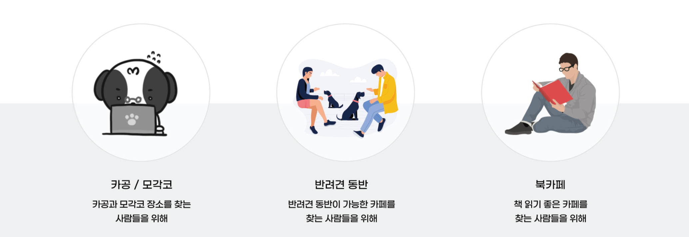
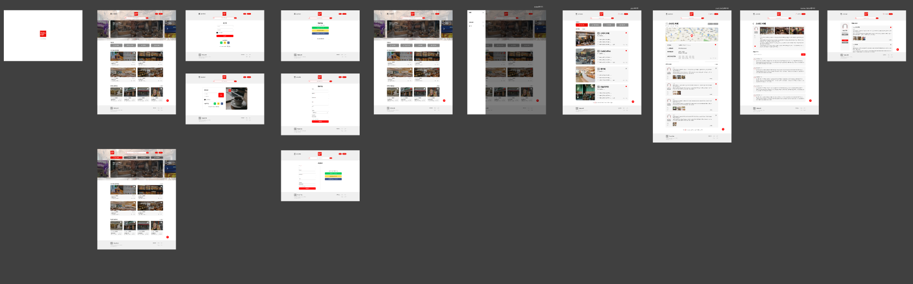
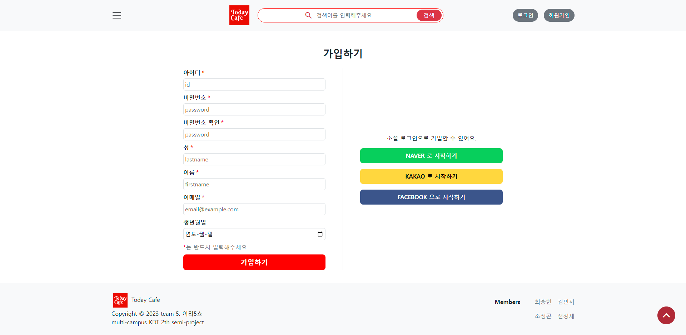
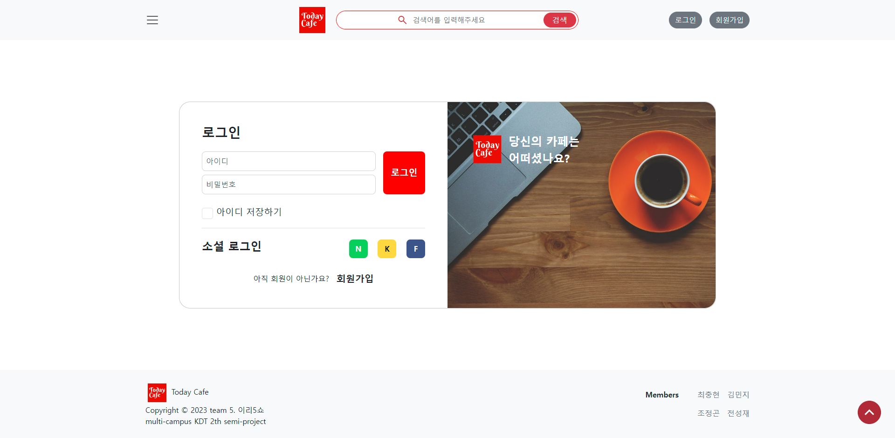
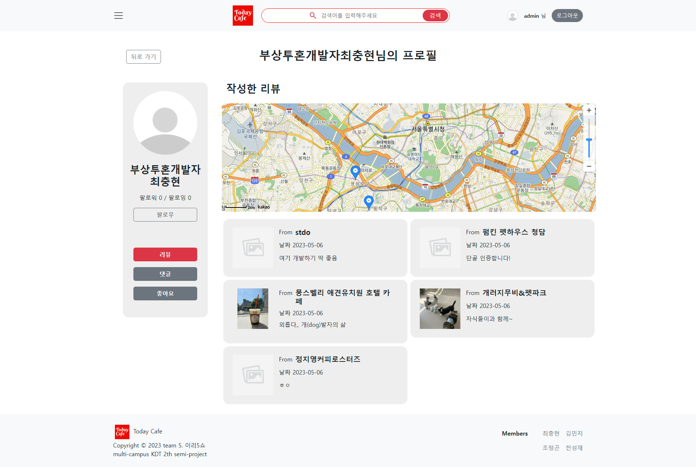
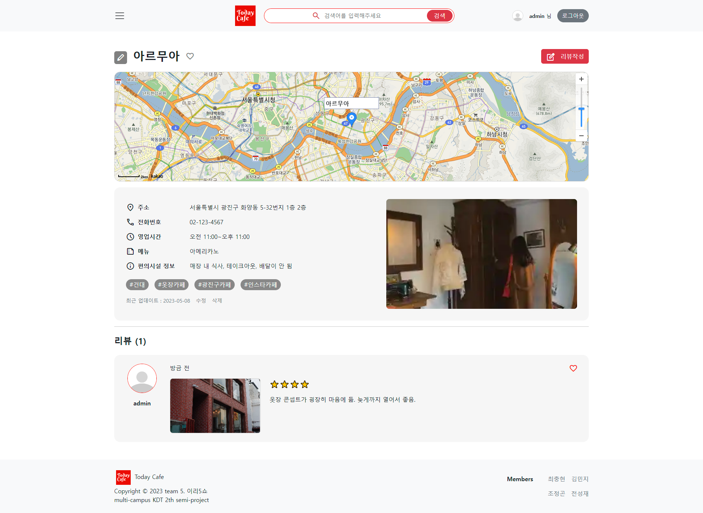
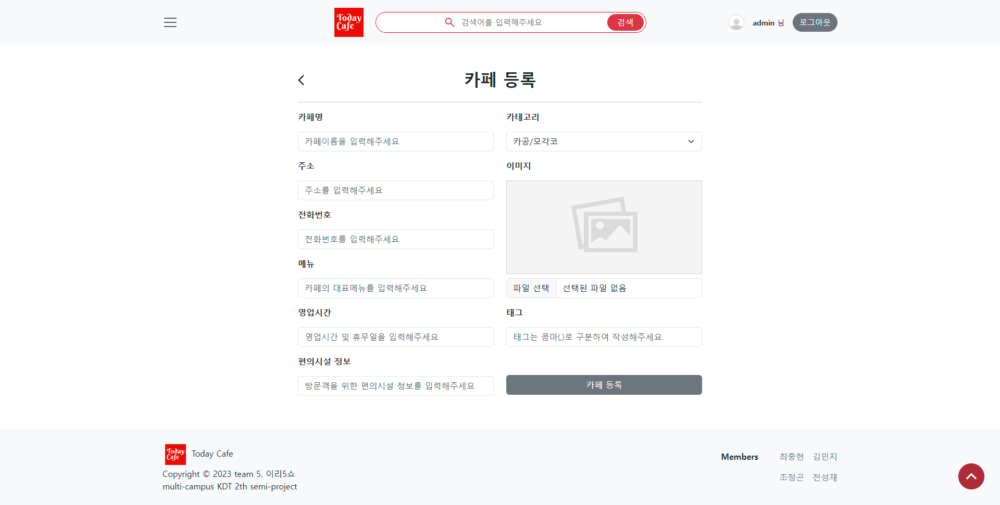
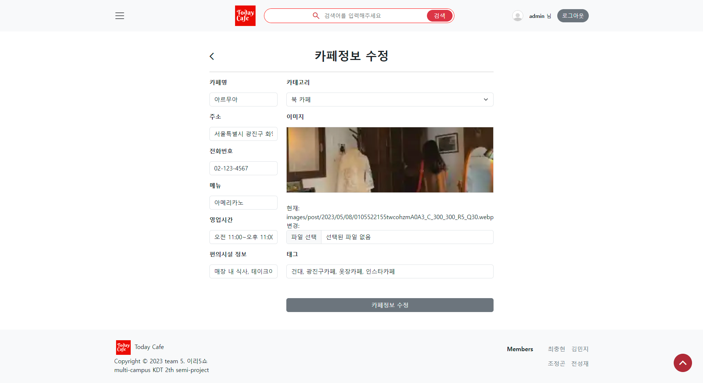
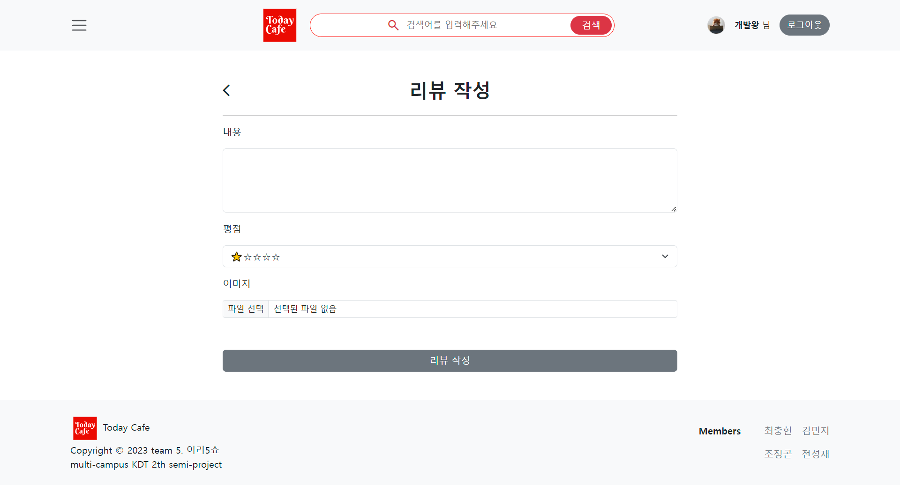
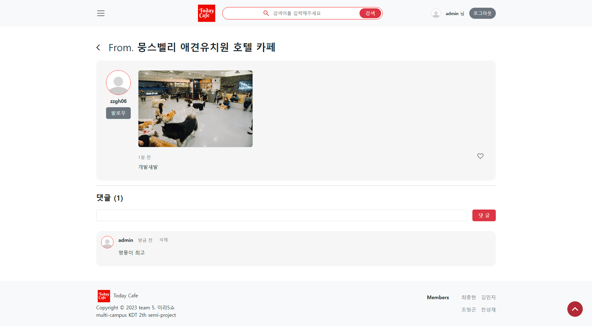

# ☕ Today Cafe

- 이색 카페 공유 커뮤니티 서비스
- 2023.04.26(수) ~ 2023.05.08(월), 이 후 디벨롭할 예정

<p align="center">
    
</p>

<details>
<summary>프로젝트 환경 설정 가이드</summary>
<div markdown="1">

1. 가상환경 생성

```bash
$ python -m venv venv
```

2. 가상환경 활성화

```bash
# 윈도우
$ . venv/Scripts/activate

# Mac
$ . venv/bin/activate
```

3. 패키지 설치

```bash
$ pip install -r requirements.txt
```

4. 마이그레이션 진행

```bash
$ python manage.py makemigrations
$ python manage.py migrate
```

5. 로컬에서 프로젝트 열기

```bash
$ python manage.py runserver
```

</div>
</details>

[프로젝트 통합관리 문서 - Notion](https://min-z.notion.site/min-z/5-80b95c94d6a04a6890dfd41e28e59bfb)

<br>
<br>

## Team | 어서5쇼

### Members

|                                               [최충현](https://github.com/zzgh06)                                              |                                                     [조정곤](https://github.com/JeonggonCho)                                                     |                                                  [김민지](https://github.com/nninzy)                                                   |                                                      [전성재](https://github.com/jeonseongjae98)                                                      |
|:----------------------------------------------------------------------------------------------------------:|:---------------------------------------------------------------------------------------------------------------:|:----------------------------------------------------------------------------------------------------------:|:-----------------------------------------------------------------------------------------------------------------:|
| [](https://github.com/zzgh06) | [](https://github.com/JeonggonCho) | [](https://github.com/nninzy) | [](https://github.com/jeonseongjae98) |
|                                                 조장<br/>백엔드                                                 |                                              프론트엔드<br/>[posts 관련]                                               |                                          프론트엔드<br/>[accounts 관련]                                           |                                                        백엔드                                                        |

<br>
<br>

## 1. 프로젝트 소개

### 개요

- 국세통계포털에 따르면 대한민국의 카페 수는 2023년 기준 `93,414개`로 카페 공화국이라고 할 정도로 카페의 공급이 증가하고 있다. `과거의 카페`는 `단순히 커피와 디저트를 소비하는 공간`의 역할을 하였지만, 최근에는 `카공족`, `반려견 카페`라는 말이 생겨난 만큼 카페는 커피 소비를 넘어 다양한 활동과 체험을 할 수 있는 공간으로 의미가 확장되었다. `기존의 카페와 더불어 이색 카페의 정보를 얻는데 도움`이 되고자 본 프로젝트를 기획하게 되었다.

<br>

### 타겟

<p align="center">
    
</p>

<br>

### References

- [다이닝 코드](https://www.diningcode.com/)
- [식신](https://www.siksinhot.com/)
- ~~[망고플레이트](https://www.mangoplate.com/)~~

<br>
<br>

## 2. Commit Conventions

- commit -m '동사 + 목적어 by 작업자'
  - Fix : 수정 (문제 부분 수정)
  - Add : 추가 Remove - 삭제
  - Use : 사용 (instead 대체 / to 지향점 / for 적용점)
  - Refactor : 전면 수정
  - Simplify : 코드 단순화
  - Update : 버전 업데이트 (정상 동작 상태에서 업데이트)
  - Improve : 향상 (호환성, 성능, 접근성 등)
  - Make : 기존 동작 변경
  - Correct : 문법 요류 수정, 타입 변경 Rename - 이름 변경
  - Set : 변수값 변경

<br>
<br>

## 3. 주요 기능

### 👨‍👩‍👧‍👦 회원관리
  - 회원가입 (소셜 회원가입 포함)
  - 로그인
  - 로그아웃
  - 회원 프로필
    - 팔로우/팔로잉
    - 좋아요한 글 모아보기

### ✍️ 글 작성
  - 카테고리 별 카페 (북카페, 펫카페, 스터디카페)
    - 카페 조회 수
    - 카페 리뷰 수
    - 카페 좋아요 수
    - 카페 평점
    - 카페 위치 지도 표시
    - 카페 세부 정보 (주소, 전화번호, 메뉴, 영업시간)
  - 리뷰
    - 작성자
      - 팔로우
    - 작성시간
  - 댓글
  - 좋아요

<br>
<br>

## 4. 역할

### 👨‍💻 최충현

[//]: # (1. 프로젝트 스케줄 관리)

[//]: # (2. 데일리 스크럼 진행)

<br>

### ‍👨‍💻 조정곤

[//]: # (1. Figma를 이용한 와이어프레임 및 목업 제작)

<br>

### 👩‍💻 김민지

[//]: # (1. Notion을 통해 스케쥴, 규칙, 이슈 등 명세화)

<br>

### ‍👨‍💻 전성재

[//]: # (1. )

<br>
<br>

## 5. 개발 환경

### Frontend

<ul>
    <li style="list-style: none; margin-bottom: 20px;">
        <div style="display: flex; align-items: center; gap: 5px;">
            <h4>Django (ver. 3.2.18.)</h4>
        </div>
        <div>: Python을 사용하는 풀스택 웹 프레임워크로서 다양한 라이브러리들을 이용할 수 있으며, 내장 기능을 통해 로그인, 회원가입, 인증 등의 구현을 쉽게 처리할 수 있다. MTV 패턴을 활용하여 Template의 HTML에 DTL문법을 접목하여 특수한 상황 조작이 가능하며, 이러한 특징들을 통해 개발시간을 크게 단축 시킬 수 있다.</div>
    </li>
    <li style="list-style: none; margin-bottom: 20px;">
        <div style="display: flex; align-items: center; gap: 5px;">
            <h4>Bootstrap (ver. 5.3.0.)</h4>
        </div>
        <div>: 부트스트랩은 웹사이트를 쉽게 만들 수 있게 도와주는 CSS, JS 프레임워크로 제공하는 컴포넌트들을 활용하여 빠르게 UI를 구축할 수 있도록 도와준다. 또한 클래스를 통해 커스텀이 가능하다. CSS 프레임워크 중 가장 높은 점유율로 협업 시, 좀 더 유리한 편이다.</div>
    </li>
    <li style="list-style: none; margin-bottom: 20px;">
        <div style="display: flex; align-items: center; gap: 5px;">
            <h4>HTML</h4>
        </div>
        <div>: Django의 Template 구축에 활용한다.</div>
    </li>
    <li style="list-style: none; margin-bottom: 20px;">
        <div style="display: flex; align-items: center; gap: 5px;">
            <h4>CSS</h4>
        </div>
        <div>: Bootstrap을 통해 커스텀 하기 어렵거나 세부적인 스타일링이 필요할 경우, 활용한다.</div>
    </li>
    <li style="list-style: none; margin-bottom: 20px;">
        <div style="display: flex; align-items: center; gap: 5px;">
            <h4>JavaScript</h4>
        </div>
        <div>: DOM 조작을 통해 웹 사이트와 상호작용하기 위해 사용한다.</div>
    </li>
    <li style="list-style: none; margin-bottom: 20px;">
        <div style="display: flex; align-items: center; gap: 5px;">
            <h4>Axios</h4>
        </div>
        <div>: Axios는 Node.js와 브라우저를 위한 Promise API를 활용하는 HTTP 통신 라이브러리로 비동기 HTTP 통신이 가능하다. 크로스 브라우징 최적화로 여러 브라우저에서 호환성(구형 브라우저 지원)이 뛰어나며, response Timeout으로 인해 특정 시간이 지나면 통신이 자동으로 중단되는 JavaScript의 fetch와 비교 시, Axios는 이를 적절히 처리(에러페이지 보여주기) 할 수 있다.</div>
    </li>
</ul>

### Backend

<ul>
    <li style="list-style: none; margin-bottom: 20px;">
        <div style="display: flex; align-items: center; gap: 5px;">
            <h4>Django (ver. 3.2.18.)</h4>
        </div>
        <div>: Python을 사용하는 풀스택 웹 프레임워크로서 Python의 Class를 통해 Model 생성(Schema)과 동시에 데이터 베이스를 생성할 수 있으며, View에서 QuerySet API를 통해 데이터를 Query하는 것이 가능하다.</div>
    </li>
    <li style="list-style: none; margin-bottom: 20px;">
        <div style="display: flex; align-items: center; gap: 5px;">
            <h4>Python</h4>
        </div>
        <div>: Python은 직관적이고 간결한 문법으로, 프로그래머들은 물론 비전공자들 사이에서도 최근 가장 주목받는 언어이다. 또한 스크립트 언어이기에 별도의 컴파일 과정없이 실행결과를 바로 확인하며 개발할 수 있다.</div>
    </li>
    <li style="list-style: none;">
        <div style="display: flex; align-items: center; gap: 5px;">
            <h4>SQLite</h4>
        </div>
        <div>: 데이터베이스 관리 시스템으로 Python환경에선 sqlite3모듈을 통해 쉽게 사용할 수 있기에 Django로 개발하는 경우, 활용하기에 좋다. 대규모 프로젝트에서는 적합하지 않으나, 우리의 커뮤니티 사이트는 규모가 크지 않기에 간편하고 가볍기에 사용성에 좋다고 판단되어 도입하였다.</div>
    </li>
</ul>

### 협업툴

<ul>
    <li style="list-style: none; margin-bottom: 20px;">
        <div style="display: flex; align-items: center; gap: 5px;">
            <h4>Figma</h4>
        </div>
        <div>: 디자인을 위한 툴로서 와이어프레임, 목업, 프로토타입 제작에 용이하며, 실시간 협업이 가능하다.</div>
    </li>
    <li style="list-style: none; margin-bottom: 20px;">
        <div style="display: flex; align-items: center; gap: 5px;">
            <h4>Notion</h4>
        </div>
        <div>: Markdown 문법을 지원하며, 명세서 등의 문서화에 특화되어있다.</div>
    </li>
    <li style="list-style: none;">
        <div style="display: flex; align-items: center; gap: 5px;">
            <h4>Discord</h4>
        </div>
        <div>: 회의 및 데일리 스크럼을 진행할 경우, 실시간 화면 공유를 통해 빠르고 정확한 정보 공유가 가능하다</div>
    </li>
</ul>

### Deployment

<ul>
    <li style="list-style: none;">
        <div style="display: flex; align-items: center; gap: 5px;">
            <h4>Cloudtype</h4>
        </div>
        <div>: 클라우드타입의 경우, 어플리케이션을 빠르고 편리하게 배포할 수 있는 컨테이너 기반 클라우드 서비스로서</div>
    </li>
</ul>

<br>
<br>

## 6. ERD 모델 설계

<p align="center">
    
</p>

[Today Cafe - ERD 제작 링크](https://www.erdcloud.com/d/bM69yrQQGYKHP4kQE)

<br>
<br>

## 7. 디자인

### 와이어프레임

<p align="center">
    
</p>

### 목업

<p align="center">
    
</p>

[Today Cafe - Figma 링크](https://www.figma.com/file/7voE7Aq559sa9Bg0yG41Zf/5%EC%A1%B0-%ED%94%84%EB%A1%9C%EC%A0%9D%ED%8A%B8_today-cafe?type=design&node-id=0-1&mode=design&t=DFdPIDBwvxjq86lp-0)

<br>
<br>

## 8. 프로젝트 구조

```
Today_Cafe
│
├─ accounts
│  ├─ forms.py
│  ├─ models.py
│  ├─ static
│  │  └─ accounts
│  │     ├─ css
│  │     │  ├─ login.css
│  │     │  ├─ profile.css
│  │     │  ├─ signup.css
│  │     │  ├─ update.css
│  │     │  └─ variables.css
│  │     ├─ img
│  │     │  └─ no_profile.jpeg
│  │     └─ js
│  │        ├─ profile__category-btn.js
│  │        ├─ profile__follow-btn.js
│  │        ├─ profile__map.js
│  │        ├─ update__delete-user.js
│  │        └─ update__image.js
│  ├─ templates
│  │  └─ accounts
│  │     ├─ change_password.html
│  │     ├─ login.html
│  │     ├─ profile.html
│  │     ├─ signup.html
│  │     └─ update.html
│  ├─ urls.py
│  └─ views.py
│
├─ posts
│  ├─ forms.py
│  ├─ models.py
│  ├─ static
│  │  └─ posts
│  │     ├─ css
│  │     │  ├─ create.css
│  │     │  ├─ detail.css
│  │     │  ├─ post.css
│  │     │  ├─ posts.css
│  │     │  ├─ reset.css
│  │     │  ├─ search.css
│  │     │  ├─ tagged.css
│  │     │  └─ variables.css
│  │     ├─ img
│  │     │  ├─ all_category.jpg
│  │     │  ├─ book_cafe.png
│  │     │  ├─ no_img.jpg
│  │     │  ├─ pet_cafe.jpg
│  │     │  └─ study_cafe.png
│  │     └─ js
│  │        ├─ postFollow.js
│  │        ├─ postLike.js
│  │        ├─ postMap.js
│  │        ├─ postReviewLike.js
│  │        ├─ postsLike.js
│  │        ├─ postsMap.js
│  │        ├─ reviewDetailFollow.js
│  │        ├─ reviewLike.js
│  │        ├─ searchLike.js
│  │        └─ taggedLike.js
│  ├─ templates
│  │  └─ posts
│  │     ├─ create.html
│  │     ├─ post.html
│  │     ├─ posts.html
│  │     ├─ review_create.html
│  │     ├─ review_detail.html
│  │     ├─ review_update.html
│  │     ├─ search.html
│  │     ├─ tagged.html
│  │     └─ update.html
│  ├─ urls.py
│  └─ views.py
│
├─ project
│  ├─ settings.py
│  ├─ urls.py
│  └─ views.py
│
├─ requirements.txt
│
├─ static
│  ├─ css
│  │  ├─ base.css
│  │  ├─ index.css
│  │  ├─ reset.css
│  │  └─ variables.css
│  ├─ img
│  │  ├─ favicon.ico
│  │  └─ today-cafe_Logo.svg
│  └─ js
│     ├─ baseTop.js
│     └─ index__clock.js
│
└─ templates
   ├─ base.html
   └─ index.html

```

<br>
<br>

## 9. URL 및 View 설계

### accounts

| 기능      | 메소드      | 요청 url                        | name            |
|---------|----------|-------------------------------|-----------------|
| 프로필     | GET      | /accounts/profile/<username>/ | profile         |
| 팔로우     | POST     | /accounts/<user_pk>/follow/   | follow          |
| 로그인     | GET/POST | /accounts/login/              | login           |
| 로그아웃    | POST     | /accounts/logout/             | logout          |
| 회원가입    | GET/POST | /accounts/signup/             | signup          |
| 회원탈퇴    | POST     | /accounts/delete/             | delete          |
| 회원정보 수정 | GET/POST | /accounts/update/             | update          |
| 비밀번호 수정 | GET/POST | /accounts/password/           | change_password |

### posts

| 기능         | 메소드      | 요청 url                                                              | name            |
|------------|----------|---------------------------------------------------------------------|-----------------|
| 홈 화면       | GET      | /posts/                                                             | posts           |
| 카테고리 별 화면  | GET      | /posts/category/<subject>/                                          | category        |
| 개별 게시글 조회  | GET      | /posts/<post_pk>/                                                   | post            |
| 카페 포스트 생성  | GET/POST | /posts/create/                                                      | create          |
| 카페 포스트 삭제  | POST     | /posts/<post_pk>/delete/                                            | delete          |
| 카페 포스트 수정  | GET/POST | /posts/<post_pk>/update/                                            | update          |
| 카페 포스트 좋아요 | POST     | /posts/<post_pk>/likes/                                             | likes           |
| 리뷰 조회      | GET      | /posts/<post_pk>/reviews/<review_pk>/                               | review_detail   |
| 리뷰 생성      | GET/POST | /posts/<post_pk>/reviews/                                           | review_create   |
| 리뷰 수정      | GET/POST | /posts/<post_pk>/reviews/<review_pk>/update/                        | review_update   |
| 리뷰 삭제      | POST     | /posts/<post_pk>/reviews/<review_pk>/delete/                        | review_delete   |
| 리뷰 좋아요     | POST     | /posts/<post_pk>/reviews/<review_pk>/likes/                         | review_likes    |
| 댓글 생성      | POST     | /posts/<post_pk>/reviews/<review_pk>/comments/                      | comments_create |
| 댓글 삭제      | POST     | /posts/<post_pk>/reviews/<review_pk>/comments/<comments_pk>/delete/ | comments_delete |
| 검색         | GET      | /posts/search/                                                      | search          |
| 태그         | GET      | /posts/tags/<tag_pk>/                                               | tagged          |


<br>
<br>

## 10. 서비스 화면

### 인덱스 페이지


- CSS animation을 활용한 `splash screen`
- Date 생성자 함수 활용한 `초단위 + 12시간 단위 시계`
- random 함수 활용한 `오늘의 카페 메뉴 추천`
- Bootstrap을 활용한 `Carousel 템플릿`
  (각 카테고리별 페이지로 이동할 수 있는 이미지를 넣으려고 했음)
- 스크롤을 진행할 경우 상단으로 이동할 수 있는 `top button`

<br>

### 회원가입



<br>

### 로그인



<br>

### 프로필



<br>

### 카테고리별 카페 목록


<br>

### 카페 상세



<br>

### 카페 등록(관리자만 접근 가능)



<br>

### 카페 정보 수정(관리자만 접근 가능)



<br>

### 카페 리뷰 작성



<br>

### 리뷰 상세(댓글 작성)



<br>
<br>

## 11. 이슈

<br>
<br>

## 12. 회고

### Keep

  1. 계속 코드를 작성하며 이전에 헷갈리거나 이해하지 못했던 부분을  이해할 수 있었던 기회마련
  2. 백엔드와 프론트엔드를 나누어 작업하여 팀원들이 각 분야에서 전문성 향상
  3. 프로젝트 발표 및 공유를 통해 다른 조들의 방식과 결과물을 보며 많은 영감과 긍정적인 자극이 되었음
  4. 여럿이서 진행하다보니 git과 github 등의 협업 툴을 사용하는 과정에서 다양한 문제를 경험하고 함께 해결해나갈 수 있어 좋았음

### Problem

  1. 우선순위가 낮은 기능에 몰두한 점과 디버깅에 많은 시간이 소요되어 아쉬움
  2. 새로운 기능 구현에 따른 템플릿 페이지 증가에 따른 프론트 엔드 업무 과중
  3. Github에 대한 이해가 부족한 상태에서 진행되다 보니 Merge할 때 에러가 나서 그런 부분을 해결하는데 시간을 할애하다 보니, 개발에 몰입하는 시간이 상대적으로 줄어들었던 것도 작업에 악영향을 주었던 것으로 판단됨
  4. 겉으로 보이는 문제 해결을 위해 성능에 좋지 않은 방법들을 선택했고, 해당 방식을 선택했을 때 어떤 문제가 생길 수 있는지, 다른 방법은 없는지 폭넓게 생각하지 못 했음
  5. 프로젝트 마감일이 가까울수록 커밋 컨벤션 등 규칙이 지켜지지 않은 문제가 있었음

### Try

  1. 추가 기능을 구현할 때 팀원 모두와 의논한 뒤 우선순위를 정하기
  2. 프로젝트 기획을 구체화하여 진행하기
  3. 문제가 발생했을 경우, 혼자서 해결하려고 고군분투하기보다는 도움을 요청하는 것도 중요한 덕목이기에 같이 해결하기
  4. Github 내 이슈와 위키 기능을 활용해 우선순위를 기준으로 작업하고, 기록을 습관화하기