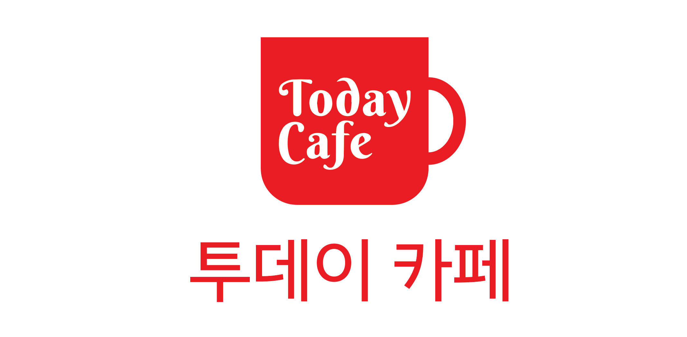
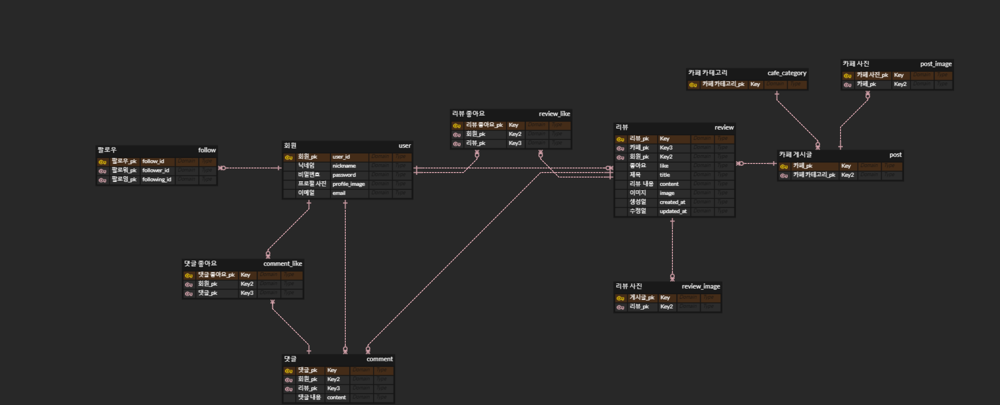
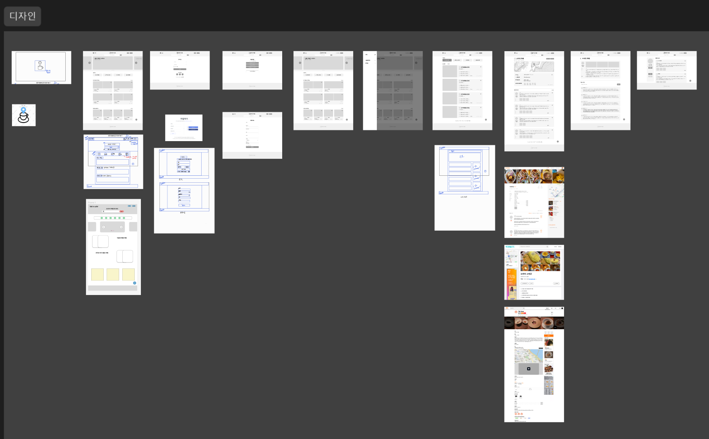

# ☕ Today Cafe

- 카페 공유 커뮤니티 서비스
- 2023.04.26(수) ~ 2023.05.08(월)

<p align="center">

</p>

## Team | 어서5쇼

## Members

|                                               [최충현](https://github.com/zzgh06)                                              |                                                     [조정곤](https://github.com/JeonggonCho)                                                     |                                                  [김민지](https://github.com/nninzy)                                                   |                                                      [전성재](https://github.com/jeonseongjae98)                                                      |
|:----------------------------------------------------------------------------------------------------------:|:---------------------------------------------------------------------------------------------------------------:|:----------------------------------------------------------------------------------------------------------:|:-----------------------------------------------------------------------------------------------------------------:|
| [](https://github.com/zzgh06) | [](https://github.com/JeonggonCho) | [](https://github.com/nninzy) | [](https://github.com/jeonseongjae98) |
|                                                 조장<br/>백엔드                                                 |                                              프론트엔드<br/>[posts 관련]                                               |                                          프론트엔드<br/>[accounts 관련]                                           |                                                        백엔드                                                        |

<br>

## 목차

1. [프로젝트 개요]()
2. [프로젝트 목표]()
3. [주요 기능]()
4. [개발 환경]()
5. [ERD 모델 설계]()
6. [와이어프레임]()
7. [프로젝트 구조]()
8. [아키텍처]()
9. [서비스 화면]()
10. [역할]()
11. [Challenge]()
12. [회고]()

<br>
<br>

<details>
<summary>프로젝트 시작 가이드</summary>
<div markdown="1">

1. 가상환경 생성

```bash
$ python -m venv venv
```

2. 가상환경 활성화

```bash
# 윈도우
$ source venv/Scripts/activate

# Mac
$ source venv/bin/activate
```

3. 패키지 설치

```bash
$ pip install -r requirements.txt
```

4. 마이그레이션 진행

```bash
$ python manage.py makemigrations
$ python manage.py migrate
```

5. 로컬에서 프로젝트 열기

```bash
$ python manage.py runserver
```

</div>
</details>

<br>

[5조 프로젝트 통합관리 문서](https://min-z.notion.site/min-z/5-80b95c94d6a04a6890dfd41e28e59bfb)

<br>

## 1. 프로젝트 개요

- 개요

<br>
<br>

## 2. 프로젝트 목표

- 목표

<br>
<br>

## 3. 주요 기능

- 기능

<br>
<br>

## 4. 개발 환경

- Frontend
- Backend

<br>
<br>

## 5. ERD 모델 설계

<p align="center">
    
</p>

[Today Cafe ERD 제작 링크](https://www.erdcloud.com/d/bM69yrQQGYKHP4kQE)

<br>
<br>

## 6. 와이어프레임

<p align="center">
    
</p>

[Today Cafe Figma 링크](https://www.figma.com/file/7voE7Aq559sa9Bg0yG41Zf/5%EC%A1%B0-%ED%94%84%EB%A1%9C%EC%A0%9D%ED%8A%B8_today-cafe?type=design&node-id=0-1&mode=design&t=DFdPIDBwvxjq86lp-0)

<br>
<br>

## 7. 프로젝트 구조

<br>
<br>

## 8. 아키텍처

<br>
<br>

## 9. 서비스 화면

### 홈화면

<br>
<br>

## 10. 역할

<br>
<br>

## 11. Challenge

<br>
<br>

## 12. 회고

